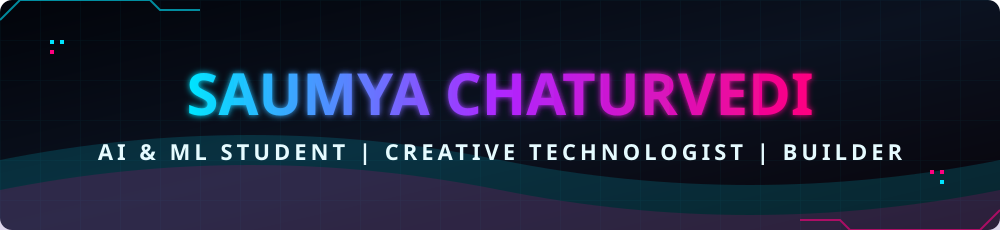
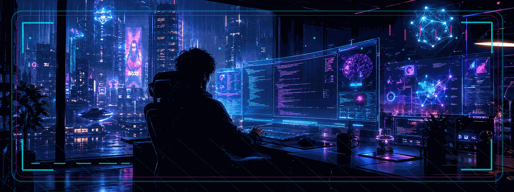
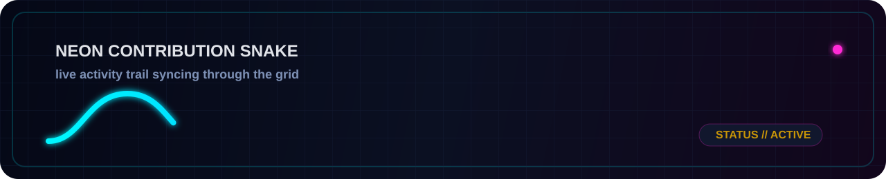
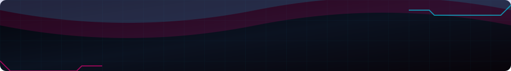

<p align="center">
  <picture>
    <source media="(prefers-color-scheme: dark)" srcset="./assets/header.svg" />
    <source media="(prefers-color-scheme: light)" srcset="./assets/header.svg" />
    
  </picture>
</p>

<p align="center">
  
</p>

<p align="center">
  
</p>

<p align="center">
  
  
  
  
  
</p>

<h3 align="center">I build like an engineer, think like an artist, and move like someone with too many ideas to stay still.</h3>

<p align="center">
  2nd-year <strong>B.Tech CSE (AI &amp; ML)</strong> student from <strong>India</strong>.<br />
  I am drawn to ambitious builds, cinematic storytelling, intelligent systems, and experiments that blur the line between technology and identity.
</p>

<p align="center">
  
  
  
</p>

<p align="center">
  
</p>

---

## 01 // About Me

```ts
const saumya = {
  location: "India",
  role: "B.Tech CSE (AI & ML) Student // 2nd Year",
  identity: ["creative technologist", "curious builder", "experimental storyteller"],
  interests: ["AI/ML", "coding", "content creation", "acting"],
  current_mode: "exploring every idea that feels bold enough to chase",
  mission: "become a top developer and a magnetic digital creator with a signature style"
};
```

<p align="center">
  I am not interested in choosing just one lane.<br />
  I want to build smart systems, tell memorable stories, and turn curiosity into a personal brand with its own gravity.
</p>

## 02 // Tech + Creative Arsenal

<p align="center">
  
</p>

<p align="center">
  
  
  
  
</p>

<p align="center">
  
  
  
  
  
</p>

<p align="center">
  
  
  
  
  
</p>

## 03 // Currently Learning

<p align="center">
  
  
  
  
  
</p>

## 04 // Featured Projects

<table>
  <tr>
    <td width="33%" align="center">
      <br /><br />
      A smart driver-safety system built to detect drowsiness before danger becomes real.<br /><br />
      Features: eye-closure tracking, yawn detection, head-pose drift alerts, low-light readiness, real-time buzzer warning, and an advanced escalation layer for emergency response.
    </td>
    <td width="33%" align="center">
      <br /><br />
      A space for computer-vision experiments, intelligent prototypes, and visual AI ideas that move from concept to usable systems.
    </td>
    <td width="33%" align="center">
      <br /><br />
      A future-facing content lab for edits, reels, motion design, storytelling formats, and creative systems that grow alongside my developer journey.
    </td>
  </tr>
</table>

## 05 // System Telemetry

<p align="center">
  
  
</p>

<p align="center">
  
</p>

## 06 // Contribution Pulse

<p align="center">
  
</p>

## 07 // Snake Animation

<p align="center">
  <picture>
    <source media="(prefers-color-scheme: dark)" srcset="./output/github-contribution-grid-snake-dark.svg" />
    <source media="(prefers-color-scheme: light)" srcset="./output/github-contribution-grid-snake.svg" />
    
  </picture>
</p>

## 08 // Goals / Vision

<p align="center">
  I am building more than projects.<br />
  I am building presence, range, and a body of work that feels unmistakably mine.<br />
  The long game is clear: create intelligent products, unforgettable content, and a career with its own signature energy.
</p>

## 09 // Connect With Me

<p align="center">
  <a href="https://github.com/SaumyaChaturvedii">
    
  </a>
  <a href="https://www.linkedin.com/in/saumya-chaturvedi-46aa542ba/">
    
  </a>
  <a href="https://www.instagram.com/saumya.chaturvedii?igsh=YWdhbGoxcm5keXo3">
    
  </a>
  <a href="https://www.youtube.com/@Saumya.Chaturvedii">
    
  </a>
  <a href="mailto:saumya.chaturvedii01@gmail.com">
    
  </a>
</p>

<p align="center">
  <sub>future-facing code • cinematic storytelling • relentless iteration</sub>
</p>

<p align="center">
  <picture>
    <source media="(prefers-color-scheme: dark)" srcset="./assets/footer.svg" />
    <source media="(prefers-color-scheme: light)" srcset="./assets/footer.svg" />
    
  </picture>
</p>
